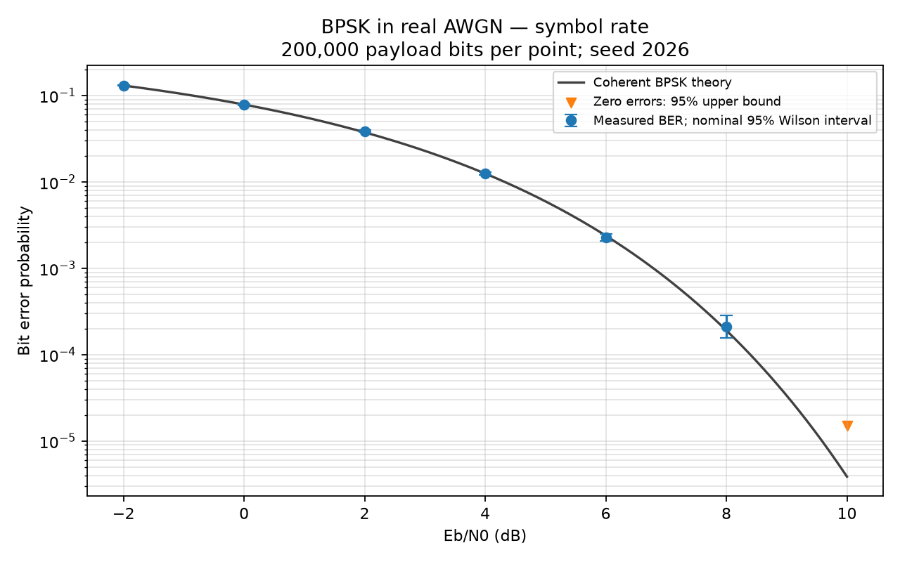
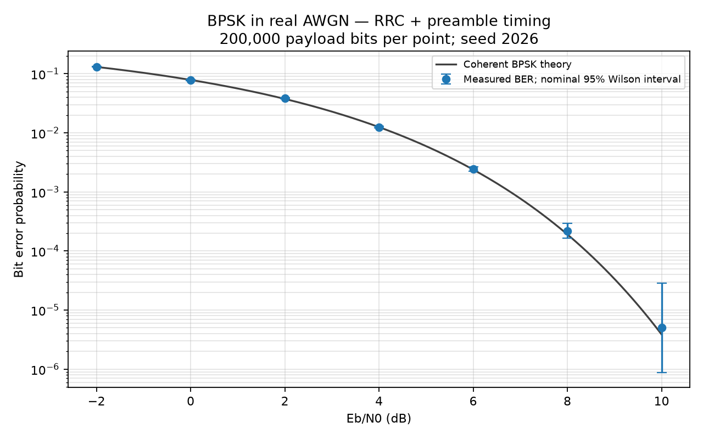
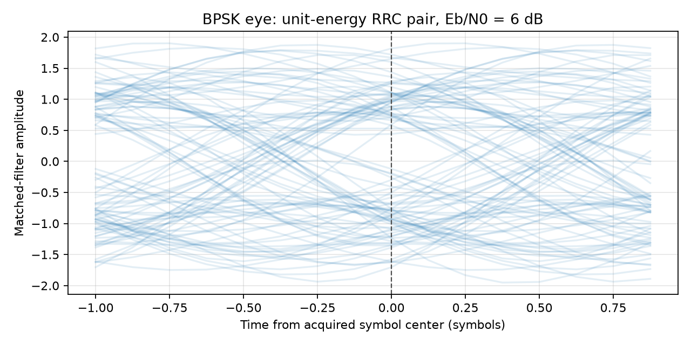
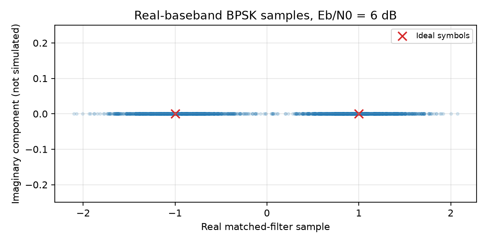

# Digital Communications Simulation

A small, reproducible Python laboratory for **coherent real-baseband BPSK in
AWGN**. Compare a symbol-rate baseline with a pulse-shaped transmitter and
receiver, inspect an eye diagram, and read the actual error counts behind every
BER point. Numerical work uses NumPy; figures use Matplotlib; tests use `unittest`.

## Reproduce the experiments

Use Python 3.12 and the pinned dependencies. From the repository root:

```bash
python -m venv .venv
source .venv/bin/activate
python -m pip install -r requirements.txt
python -m unittest discover -s tests -v
python run_demo.py --bits 200000 --seed 2026
```

On Windows, use `.venv\Scripts\Activate.ps1` instead of `source`.
The demo saves four figures in `images/`, two measurement tables in `results/`,
and `results/manifest.json` with seeds, filter/channel settings, and library
versions. It opens no graphical window. CI runs the tests and a smaller headless
demo, then uploads its figures and CSVs as an artifact.

Individual experiments remain available through `main_ber.py`,
`main_ber_fullchain.py`, `main_eye.py`, and `main_constellation.py`. The BER
scripts accept `--bits`, `--seed`, and `--output-dir`. For more precise rare-error
measurements, increase the bit budget, for example `--bits 2000000`.

## Signal and noise conventions

The mapper uses **0 → −1, 1 → +1**; the receiver decides 1 for a positive sample
and 0 otherwise. Each bit carries one uncoded BPSK symbol.

The full chain upsamples by eight and uses a symmetric **root-raised-cosine
(RRC)** pulse with 81 taps and roll-off 0.35. Each pulse has
`sum(h**2) = 1`. The receiver applies its time-reversed matched filter. Full
linear convolutions preserve the tails; two 40-sample group delays add to 80
samples. A finite RRC pair approximates a raised-cosine response: this filter's
largest off-center symbol-spaced response is about 0.00582, so residual ISI is
small but nonzero. [RRC filtering and finite-length effects](https://www.mathworks.com/help/signal/ref/rcosdesign.html).

All horizontal axes are **Eb/N0**, not waveform-average sample-power SNR.
With normalized sample time, amplitude A, and pulse h:

```text
Eb = A² sum(h²) = 1
gamma_b = 10**(EbN0_dB / 10)
variance of each real noise sample = N0/2 = Eb / (2 gamma_b)
```

The unit-energy matched filter preserves that noise variance at each decision
sample. No noise power is estimated from the particular payload or quiet
guards. For eight samples/symbol, nominal average waveform power is about 1/8;
0 dB Eb/N0 therefore corresponds to about −6.02 dB sample-power SNR. The
real-signal factor of two matters. [AWGN normalization](https://www.mathworks.com/help/comm/ref/comm.awgnchannel-system-object.html).

## Receiver timing without payload answers

Each frame contains 1,024 known pseudorandom training symbols, up to 50,000
unknown payload bits, and quiet guards on both ends. The channel inserts a
random integer delay from zero to seven samples. The receiver tests those eight
phases by normalized correlation with **interior preamble symbols only**.
Training edges are excluded far enough to prevent unknown payload filter tails
from affecting the score. It never chooses a phase by payload BER.

The best score must reach 0.45. Noise-only or incomplete training is rejected;
an acquisition failure aborts the BER measurement instead of dropping a failed
frame. This is a bounded acquisition exercise with a heuristic threshold, not
a calibrated packet detector. [Known-preamble correlation](https://www.mathworks.com/help/comm/ref/comm.preambledetector-system-object.html).

The model assumes a known coarse frame position, symbol rate, and carrier
polarity. It does not handle fractional delay, clock drift, carrier frequency
offset, fading, or coding. Training costs 1,024 symbols per frame, plus quiet
guards and filter tails. Reported Eb refers to a data symbol; it excludes the
energy overhead amortized over payload bits. The bit source is seeded random
data, not an LFSR PRBS implementation.

## Measured BER and uncertainty

Coherent BPSK theory is `Pb = Q(sqrt(2 Eb/N0)) = 0.5 erfc(sqrt(Eb/N0))`.
[Analytical BPSK reference](https://www.mathworks.com/help/comm/ug/analytical-expressions-used-in-berawgn-function-and-bit-error-rate-analysis-app.html).

This committed run uses 200,000 payload bits per point, base seed 2026, and
`base_seed + point_index` for each point. All 28 full-chain frames acquired;
none selected the wrong integer phase. Timing mismatch counts are evaluation
diagnostics and never feed the receiver.

| Eb/N0 | Full-chain errors | Measured BER | Nominal 95% interval | Theory |
|---:|---:|---:|---:|---:|
| −2 dB | 26,227 | 0.131135 | 0.129663–0.132621 | 0.130644 |
| 0 dB | 15,644 | 0.078220 | 0.077051–0.079405 | 0.078650 |
| 2 dB | 7,725 | 0.038625 | 0.037789–0.039478 | 0.037506 |
| 4 dB | 2,507 | 0.012535 | 0.012057–0.013032 | 0.012501 |
| 6 dB | 489 | 0.002445 | 0.002238–0.002671 | 0.002388 |
| 8 dB | 44 | 0.000220 | 0.000164–0.000295 | 0.000191 |
| 10 dB | 1 | 0.000005 | 0.000000883–0.000028324 | 0.000003872 |

Intervals use the two-sided Wilson method. Zero observed errors use the
one-sided 95% upper bound `1 - 0.05**(1/N)`: the symbol-rate run at 10 dB has
0/200,000 errors, giving **BER < 1.49785e-5**, rather than evidence of zero true
BER. Plots place a downward triangle at that bound on the logarithmic axis.
[Binomial interval methods](https://www.itl.nist.gov/div898/handbook/prc/section2/prc241.htm).

Intervals are per point, not simultaneous guarantees. At 2 dB this seeded run's
intervals miss ideal theory in both models. Finite Monte Carlo sampling matters;
repeat with a larger budget and other seeds to assess stability. The binomial
intervals assume independent errors. Finite pulse truncation and a timing
estimate shared within a frame make that assumption approximate for the full
chain, so its intervals and zero-error bounds are **nominal**.









## Checks and source layout

The tests cover mapping, RRC singular limits and energy, matched-filter noise
variance, all integer phases, independence from unknown payload, acquisition
rejection, complete error counting, confidence bounds, deterministic frame
budgets, and theory comparisons. Oversampling checks keep filter span fixed at
ten symbols while changing samples/symbol. Monte Carlo regressions use fixed
seeds and six-standard-deviation tolerances; a nominal 95% interval is not used
as a pass/fail guarantee.

- `dsp/channel.py`: explicit real AWGN normalization.
- `dsp/filters.py`: RRC pulse and full convolution.
- `dsp/receiver.py`: preamble phase acquisition, decisions, strict error counts.
- `dsp/simulation.py`: framed Tx/channel/Rx and symbol-rate baseline.
- `dsp/statistics.py`: theory and count-based intervals.
- `dsp/experiments.py`: CSV export and scientific plots.
- `tests/`: deterministic physical and statistical regressions.

Author: [Maxence Jules](https://github.com/Maxencejules).
